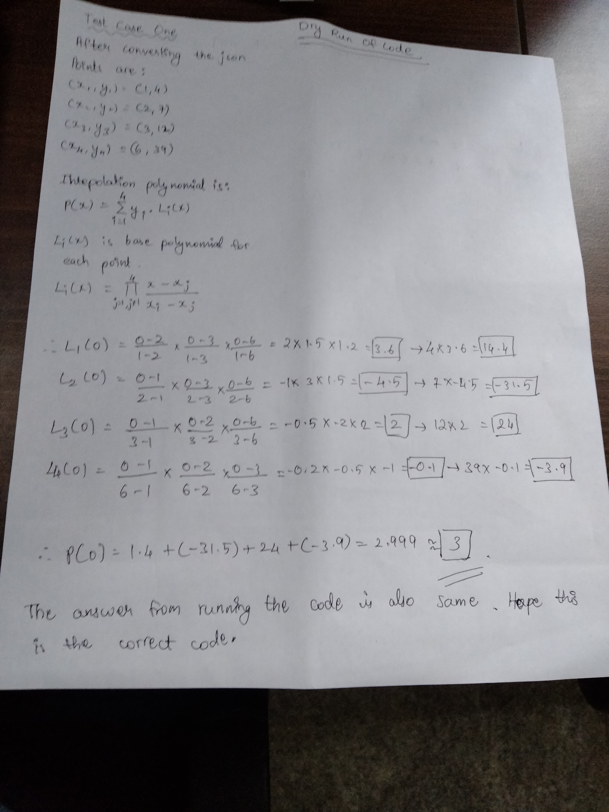

# **P Dhanush Adithyan's(AIML) Solution to Shamir's Secret Sharing Problem**

Please do go through my hand written dry run of the code in the bottom 
## **Overview**
This repository contains my solution to **Shamir's Secret Sharing algorithm**. 

**How to Run**
Run the main.cpp using your ide. The default is set for testcase 1. Change the input file name to testcase 2 for changing the testcase. 

**Formula used:**
Lagrange Polynomial Interpolation

###Solution in C++**
I know the easiest way to parse the json file was using java but couldnt spend more time on connect java with my c++ code which I am more familiar with. So, I used a pre built library to parse json file. 

## **Code Dry Run**

## **Answers I got** 

For test case 1: 
x_values: 1 2 3 6 
y_values: 4 7 12 39 
The constant term 'c' is: 3

For test case 2: 
x_values: 1 2 3 4 5 6 7 8 9 
y_values: 28735619723837 28735619723466 28735619721359 28735619714108 28735619695329 28735619654702 28859585857715 28735619441184 28735619219333 
The constant term 'c' is: 2.87356e+13
